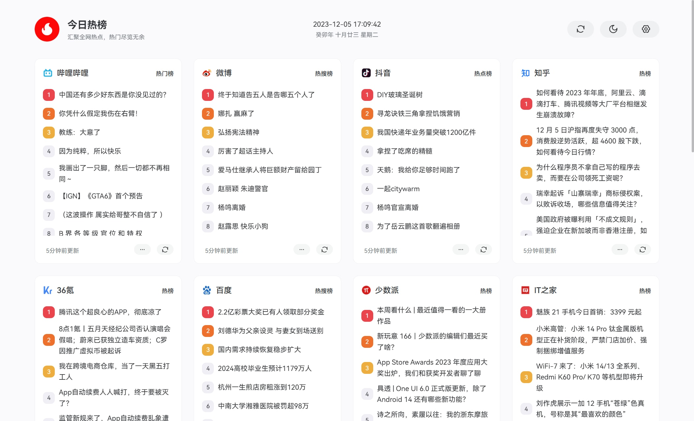

> 🙏 本项目基于 [imsyy/DailyHot](https://github.com/imsyy/DailyHot) 二次开发，感谢原作者的开放与分享。若你同样喜欢「今日热榜」，请为原项目点亮一颗 ⭐ 支持！
> 
> 🔗 配套后端由 [ShellMonster/DailyHotApi-Go](https://github.com/ShellMonster/DailyHotApi-Go) 提供，欢迎一并关注。

<div align="center">
  
  <h2>今日热榜 · DailyHot</h2>
  <p>汇聚全网热点，热门尽览无余</p>
  
</div>

---

## ✨ 项目亮点

- **多平台热点聚合**：内置哔哩哔哩、微博、知乎、少数派等 20+ 榜单，按需开启或停用，满足不同兴趣圈层。
- **首页懒加载 & 缓存**：榜单仅在可见时请求，配合 5 分钟本地缓存与失败重试，让页面更快、更稳。
- **个性化定制**：支持拖拽排序、列表字体调节、跳转方式切换、明暗主题以及自动跟随系统。
- **PWA 支持**：内置 `vite-plugin-pwa`，可安装为桌面 / 移动应用，离线时亦可查看最近访问的内容。
- **现代技术栈**：基于 Vue 3 + Vite 7 + Pinia + Naive UI，按需拆包并提供可视化分析脚本，便于持续优化。

## 🔧 与原版相比的优化

- `src/api/hotListCache.js` 引入内存 + localStorage 5 分钟缓存与失败重试，配合 `Home.vue` 预热和 `HotList.vue`/`List.vue` 的懒加载，大幅减少重复请求。
- 新增 `src/utils/useVisibilityObserver.js` 复用单个 IntersectionObserver，卡片可见时才触发请求，避免每个组件各建实例。
- `src/components/AvatarPlaceholder.vue` 与 `src/utils/avatarPlaceholder.js` 提供渐变占位头像，即便缺失 logo 也能保持视觉一致。
- `src/store/index.js` 补齐 50+ 默认榜单源（含 Hostloc、Linux.do、NodeSeek、吾爱破解、游研社等），并在 `checkNewsUpdate` 中自动合并本地自定义顺序，新增来源时保留用户配置。
- `src/views/Home.vue` 预抓取前 4 个展示榜单，提升首屏体验；`src/views/Setting.vue` 异步加载 `vuedraggable` 以减小首屏包体。
- `src/api/request.js` 改为独立 Axios 实例，统一超时与头信息，且在非浏览器环境中安全跳过本地存储操作。
- 构建链路升级：`vite.config.js` 增加手动分包、PWA 资源精细化缓存、`pnpm analyze` 对应的体积分析插件，并在 `package.json` 中升级相关依赖。
- 清理无用路由（移除 `/test` 页面），同步保留精简后的页面结构与路由配置。

## 🛠 技术栈

| 分类 | 使用技术 |
| --- | --- |
| 前端框架 | Vue 3.5、Vue Router 4 |
| 状态管理 | Pinia、pinia-plugin-persistedstate |
| UI 组件 | Naive UI、@icon-park/vue-next |
| 构建工具 | Vite 7、Terser、自定义 Rollup Chunk |
| PWA | vite-plugin-pwa、Workbox 7 |
| 其他 | Axios、vuedraggable、Sass |

## 📂 目录结构

```
DailyHot
├─ public/             # 静态资源（图标、榜单 logo 等）
├─ src/
│  ├─ api/             # Axios 封装 & 榜单缓存逻辑
│  ├─ components/      # 公共组件（Header、HotList、Footer 等）
│  ├─ router/          # 路由定义（首页 / 列表 / 设置 / 状态页）
│  ├─ store/           # Pinia 主数据仓库
│  ├─ utils/           # 工具模块（时间处理、懒加载观察）
│  ├─ views/           # 页面级组件
│  └─ style/           # 全局样式
├─ PERFORMANCE_PLAN.md # 性能优化方案记录
├─ FEATURE_ENHANCEMENTS.md # 功能增强建议
├─ 开发进度.md         # 里程碑 & 进度记录
├─ vite.config.js      # Vite 配置、PWA、分包策略
└─ package.json        # 依赖与脚本
```

## 🚀 快速开始

> Node.js ≥ 18.18（或 ≥ 20.11），建议使用 pnpm 10+

```bash
# 安装依赖
pnpm install

# 本地开发（默认 http://localhost:6699）
pnpm dev

# 生产构建
pnpm build

# 可选：分析构建体积（输出 stats.html）
pnpm analyze
```

## ⚙️ 环境变量

| 变量名 | 说明 | 示例 |
| --- | --- | --- |
| `VITE_GLOBAL_API` | 后端热点聚合服务地址 | `https://api-hot.imsyy.top` |
| `VITE_DIR` | 构建产物基础路径，部署于子目录时配置 | `/dailyhot/` |
| `VITE_ICP` | 页脚备案号，可选 | `鲁ICP备XXXX号` |

开发阶段可在根目录创建 `.env` 文件覆盖默认值。

## 📱 核心页面

| 页面 | 功能简介 |
| --- | --- |
| 首页（`/`） | 卡片化展示各榜单 Top15，滚动时自动懒加载数据 |
| 榜单列表（`/list`） | 展示完整榜单、分页、查看热点热度、跳转原文 |
| 设置（`/setting`） | 明暗模式、字体、跳转方式、拖拽排序、重置数据 |
| 状态页 | 403 / 404 / 500 等异常场景占位页 |

## 🧠 性能与体验

- 分离 `vue`、`naive-ui`、`pinia` 等大体积依赖至独立 chunk，并保留 `pnpm analyze` 供后续分析。
- 通过 `useVisibilityObserver` 统一懒加载逻辑，减少 IntersectionObserver 实例。
- `src/api/hotListCache` 对请求结果缓存 5 分钟，支持失败重试与 localStorage 持久化。
- PWA 仅预缓存核心资源，避免首次安装 Service Worker 时阻塞。

## 🛣 路线图

1. 短期：跨榜单搜索、新增提示标记、自动刷新策略。
2. 中期：收藏 / 稍后阅读、快速分享、API 状态提示。
3. 长期：离线阅读增强、整榜单导出、自定义数据源。

欢迎按需挑选迭代，也欢迎提交 Issue/PR 共同完善。

## ☁️ 部署提示

- 支持 Vercel、Netlify、静态站点托管等。
- 部署前请确认 `.env.production` 中的 `VITE_GLOBAL_API` 地址可访问。
- 如部署于子目录，请同步设置 `VITE_DIR`、`vite.config.js` 中 `base` 会自动读取该值。

## 📄 许可证

本项目遵循 [MIT License](./LICENSE)。

---

如在使用或二次开发过程中遇到问题，欢迎提交 Issue 或通过 PR 贡献改进 🙌
